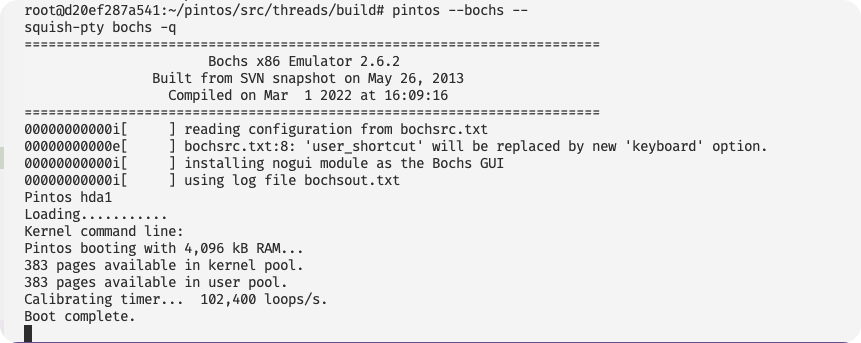

# Project 0: Getting Real

## Preliminaries

> Fill in your name and email address.

Chin Wang <wangfiox@gmail.com>

> If you have any preliminary comments on your submission, notes for the TAs, please give them here.

> Please cite any offline or online sources you consulted while preparing your submission, other than the Pintos documentation, course text, lecture notes, and course staff.

## Booting Pintos

> A1: Put the screenshot of Pintos running example here.



## Debugging

#### QUESTIONS: BIOS

> B1: What is the first instruction that gets executed?

```asm
[f000:fff0]    0xffff0: ljmp   $0xf000,$0xe05b

cs := 0xf000
ip := 0xe05b
```

> B2: At which physical address is this instruction located?

```asm
[f000:fff0] <=> 0xf_fff0
```

#### QUESTIONS: BOOTLOADER

> B3: How does the bootloader read disk sectors? In particular, what BIOS interrupt is used?

```asm
read_sector: # 0x7d1f
	pusha
	sub %ax, %ax
	push %ax			# LBA sector number [48:63], LBA(logic block address, 逻辑块寻址)
	push %ax			# LBA sector number [32:47]
	push %ebx			# LBA sector number [0:31]
	push %es			# Buffer segment. %es = 0x2000
	push %ax			# Buffer offset (always 0)
	push $1				# Number of sectors to read
	push $16			# Packet size. 数据包大小, 这个是 bios 的要求. 上面就是构建数据包的过程(push), 一共是 16 Byte
	mov $0x42, %ah			# Extended read. 表示: 使用 BIOS 扩展读功能
	mov %sp, %si			# DS:SI -> packet. si 要指向构建好的 packet. 因为是在栈中构建的.
	int $0x13			# Error code in CF. 触发 disk 中断. error code 在 CF 中
	popa				# Pop 16 bytes, preserve flags
popa_ret:
	popa
	ret				# Error code still in CF
```

> B4: How does the bootloader decides whether it successfully finds the Pintos kernel?

```py
sub main:
	buf = (uint8_t *)0x2_0000
	drivers = 80..
	for d in drivers:
		sector = read_sector(&buf, d, 0) # 第一个扇区存放着分区表
		if not sector:
			call failed()
		for i in 446..510 by 16:
			entry = sector[i, i + 16]
			if not entry[0]:
				continue
			if entry[4] != 0x20:
				continue
			if entry[0] == 0x80:
				call load_kernel(&entry, driver)

sub load_kernel(entry, driver):
	nsector = entry[15, 12] # number of sector to read. (需要读几个扇区)
	nsector = min(1024, nsector)
	first_sector = entry[11, 8]
	buf = (uint8_t *)0x2_0000
	for se in first_sector..(first_sector + nsector):
		read_sector(&buf, driver, se)
		if read failed:
			call failed()
		buf += 0x200 # 512 Byte
	call goto_start()

sub goto_start():
	_start : func_ptr = { 0x2000, *(uint16_t)(0x2_0018) }
	call _start

sub failed():
	LOG
	int $0x18

fn read_sector(buf, driver, lba):
	packet = {
		number : 16,
		nsector : 1,
		buf,
		lba,
	};
	int $0x13( $0x42, packet, driver )
```

> B5: What happens when the bootloader could not find the Pintos kernel?

It would trigger the `int $x018`, which indicating that no bootable disk was present.

> B6: At what point and how exactly does the bootloader transfer control to the Pintos kernel?

```asm
# 0x7cbf
	mov $0x2000, %ax # 我们就是把 kernel 放在 0x2000:0x0000 的地方
	mov %ax, %es
	mov %es:0x18, %dx # 0x18 是 ELF header 的 entry point, 这个就是 kernel 的入口地址. 也就是 0xc002_0058
	mov %dx, start
	movw $0x2000, start + 2
	# 0x7cd7(start): 58 00 00 20 -> 2000:0058 -> 0x2_0058
	ljmp *start
```

先在: `start:` 处写入数据: 58 00 00 20, 这标志着: ljmp 会先: cs := 0x2000, ip := 0x58, 然后再跳转到 0x2_0058 这个位置继续执行

#### QUESTIONS: KERNEL

> B7: At the entry of pintos_init(), what is the value of expression `init_page_dir[pd_no(ptov(0))]` in hexadecimal format?

0x72002c27

> B8: When `palloc_get_page()` is called for the first time,

pintos_init -> paging_init -> palloc_get_page

> > B8.1 what does the call stack look like?

```gdb
[0] from 0xc002311a in palloc_get_page+6 at ../../threads/palloc.c:98
[1] from 0xc00203aa in paging_init+17 at ../../threads/init.c:163
[2] from 0xc002031b in pintos_init+101 at ../../threads/init.c:101
[3] from 0x00010027
[4] from 0x00000000
```

> > B8.2 what is the return value in hexadecimal format?

return value is stored in %eax, which is 0xc0101000

(i386 的 system v abi, 有点..., 他的返回值居然不是第一个参数)

> > B8.3 what is the value of expression `init_page_dir[pd_no(ptov(0))]` in hexadecimal format?

0x0

> B9: When palloc_get_page() is called for the third time,

> > B9.1 what does the call stack look like?

```gdb
[0] from 0xc002311a in palloc_get_page+6 at ../../threads/palloc.c:98
[1] from 0xc0020a81 in thread_create+55 at ../../threads/thread.c:164
[2] from 0xc0020976 in thread_start+44 at ../../threads/thread.c:109
[3] from 0xc0020334 in pintos_init+126 at ../../threads/init.c:120
[4] from 0x00010027
[5] from 0x00000000
```

> > B9.2 what is the return value in hexadecimal format?

0xc0103000

> > B9.3 what is the value of expression `init_page_dir[pd_no(ptov(0))]` in hexadecimal format?

0x102027

## Kernel Monitor

> C1: Put the screenshot of your kernel monitor running example here. (It should show how your kernel shell respond to `whoami`, `exit`, and `other input`.)

####

> C2: Explain how you read and write to the console for the kernel monitor.
