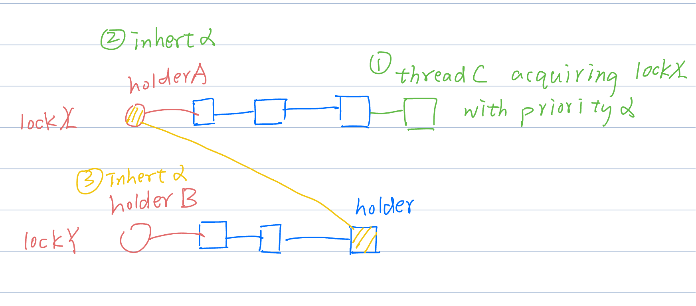

# Project 1: Threads

## Preliminaries

> Fill in your name and email address.

Chin Wang <wangfiox@gmail.com>

> If you have any preliminary comments on your submission, notes for the
> TAs, please give them here.

> Please cite any offline or online sources you consulted while
> preparing your submission, other than the Pintos documentation, course
> text, lecture notes, and course staff.

## Alarm Clock

#### DATA STRUCTURES

> A1: Copy here the declaration of each new or changed struct or struct member, global or static variable, typedef, or enumeration.
> Identify the purpose of each in 25 words or less.

```c
static struct lock timer_sleep_lock;  // 可能多线程调用 timer_sleep, 所以需要锁
static struct list timer_sleep_list;  // 链表, 里面存放的是 一排 semaphore, 并在 timer_sleep_tick 中 sema_up

struct timer_sleep_elem {
  struct list_elem elem;
  int64_t start;
  int64_t ticks;
  struct semaphore sema;
};

void timer_sleep(int64_t ticks) {
  int64_t start = timer_ticks();

  ASSERT(intr_get_level() == INTR_ON);

  struct timer_sleep_elem tse;
  tse.start = start;
  tse.ticks = ticks;
  sema_init(&tse.sema, 0);

  lock_acquire(&timer_sleep_lock);
  list_push_back(&timer_sleep_list, &tse.elem);
  lock_release(&timer_sleep_lock);

  sema_down(&tse.sema);

}

static void timer_sleep_tick(void) {
  for (struct list_elem *e = list_begin(&timer_sleep_list); e != list_end(&timer_sleep_list); e = list_next(e)) {
    struct timer_sleep_elem *tse = container_of(e, struct timer_sleep_elem, elem);
    if (timer_elapsed(tse->start) >= tse->ticks) {
      sema_up_intr(&tse->sema);
      list_remove(e);
    }
  }
}
```

#### ALGORITHMS

> A2: Briefly describe what happens in a call to timer_sleep(),
> including the effects of the timer interrupt handler.

初始化 semaphore, 初始化链表节点, 并加入到链表中. 然后 sema_down.

> A3: What steps are taken to minimize the amount of time spent in
> the timer interrupt handler?

可以用最小堆, 但是我没有用.

#### SYNCHRONIZATION

> A4: How are race conditions avoided when multiple threads call
> timer_sleep() simultaneously?

Lock the timer_sleep_list when adding the element.

> A5: How are race conditions avoided when a timer interrupt occurs
> during a call to timer_sleep()?

似乎并没有数据竞争, 因为 timer_interrupt -> timer_sleep_tick 的时候, 关中断, 这个时候可以保证 timer_sleep_list 不会被其他线程修改.
当然这个假设是: 只有一个 cpu; (我这里暂时没有考虑 多 cpu 的情况)
如果有多个 cpu, 那么可能会发生: 一个 cpu 在 timer_sleep_tick 中遍历链表, 另一个 cpu 在 timer_sleep 中将元素加入链表的情况发生. 这个时候确实需要自旋锁.

#### RATIONALE

> A6: Why did you choose this design? In what ways is it superior to
> another design you considered?

这就是一个: 生产者-消费者模型. 我是用 semaphore 实现的.
当然, 也可以使用条件变量来实现.

## Priority Scheduling

#### DATA STRUCTURES

> B1: Copy here the declaration of each new or changed struct or struct member, global or static variable, typedef, or enumeration.
> Identify the purpose of each in 25 words or less.

```c
struct lock {
  // ...
  struct list_elem elem;      /**< the elem in thread->locks */
};

struct thread {
  // ...
  int64_t last_sched; /**< last schedule time. */

  /////////////////////////////////////// priority donation
  int before_donated_priority; /**< before donated priority. */
  bool donated;                /**< Whether the thread is donated. */
  struct list locks;
  // ...
};

static int64_t last_sched(void) {
  static int64_t _data = 0;
  enum intr_level old_level;
  old_level = intr_disable();
  int64_t ret = _data++;
  intr_set_level(old_level);
  return ret;
}
```

- last_sched 用于记录: 上一次调度的时间, 这是一个时间戳. 虽说是 priority-schedule, 但是对于相同的 priority, 需要 round-robin schedule. 所以需要这个时间戳来记录.
- struct list locks: 用于记录: 当前的线程拥有哪些 🔐, lock_release 后, priority 需要重新计算.
- donated: 用于记录是否发生了 priority donation. 在 lock_acquire 中 set; 在 lock_release 中 clear. 在 thread_set_priority 中使用.
- before_donated_priority: 用于记录: 发生 priority donation 之前的 priority.

> B2: Explain the data structure used to track priority donation.
> Use ASCII art to diagram a nested donation. (Alternately, submit a
> .png file.)



#### ALGORITHMS

> B3: How do you ensure that the highest priority thread waiting for
> a lock, semaphore, or condition variable wakes up first?

```c
static struct thread *sema_pop_max_priority_thread(struct list *list) {
  struct list_elem *elem = list_max(list, sema_less_func, NULL);
  ASSERT(elem != NULL);
  list_remove(elem);
  elem->next = NULL;
  elem->prev = NULL;
  return container_of(elem, struct thread, elem);
}
```

```c
if (!list_empty(&sema->waiters)) {
  struct thread *t = sema_pop_max_priority_thread(&sema->waiters);
  ASSERT(t != NULL);
  thread_unblock(t);
}
```

> B4: Describe the sequence of events when a call to lock_acquire()
> causes a priority donation. How is nested donation handled?

```c
void lock_acquire(struct lock *lock) {
  struct thread *cur = thread_current();
  struct thread *holder = lock->holder;
  if (holder != NULL) {                      // 🔐 被占用
    if (holder->priority < cur->priority) {  // 优先级反转
      priority_donate(holder, cur->priority);
    }
  }
  sema_down(&lock->semaphore);  // ---------- 进入临界区 ----------
  lock->holder = thread_current();
  thread_push_lock(cur, lock);
}
```

```py
def priority_donate(holder, pri):
    update holder's priority with pri
    if holder is blocked:
        update the holder's holder's priority with pri recursively
```

if holderA is blocked, it means that the holderA is in the sema->waiters,
so we can find the holderB which is the owner of the sema.
then update holderB's priority with pri recursively.

however, if the user program who is a noob, wrote a deadlock code,
which would cause the infinite recursion, making the kernel panic.
we should have a mechanism to detect the loop of the holder chain.
I use a list as a stack to record the holder chain.
if the holder is already in the list, then we find the loop and truncate the recursion.

> B5: Describe the sequence of events when lock_release() is called
> on a lock that a higher-priority thread is waiting for.

```c
void lock_release(struct lock *lock) {
  thread_pop_lock(lock->holder, lock);
  int next_pri = next_priority(lock);
  if (next_pri == -1) {
    next_pri = lock->holder->before_donated_priority;
    lock->holder->donated = false;
  }
  lock->holder->priority = next_pri;
  lock->holder = NULL;        // clear holder
  sema_up(&lock->semaphore);  // ---------- 退出临界区 ----------
}
```

the next_priority is the maximum priority, the waiter who is blocked by the lock holding by the current thread.
If there is no waiter, indicating that the donation is over, then we clear the donated flag, and set the priority to the before_donated_priority.

However, another schema we should consider is that when donation happens,
the current thread called thread_set_priority, if the new_priority is lower than the priority of the current thread, which is being donated.
we should only update the before_donated_priority, not the priority, and not yield the cpu.

```c
int thread_set_priority(int new_priority) {
  struct thread *cur = thread_current();
  int old_priority = cur->priority;
  cur->before_donated_priority = new_priority;
  if (cur->donated) {
    if (old_priority < new_priority) {
      cur->priority = new_priority;
    }
  } else {
    cur->priority = new_priority;
    if (new_priority < old_priority) {
      if (!list_empty(&ready_list)) {
        struct thread *first = container_of(list_max(&ready_list, ready_list_less_func, NULL), struct thread, elem);
        ASSERT(cur != first);  // 不可能: 既 RUNNING 又 READY
        if (cur->priority < first->priority) {
          thread_yield();
        }
      }
    }
  }
  return old_priority;
}
```

#### SYNCHRONIZATION

> B6: Describe a potential race in thread_set_priority() and explain
> how your implementation avoids it. Can you use a lock to avoid
> this race?

I did not consider this race. So sad.

#### RATIONALE

> B7: Why did you choose this design? In what ways is it superior to
> another design you considered?

我原本想着是: lock 中记录最大值的, 但是这考虑到许多问题: priority 会因为 donation 而改变,
并且还会有: thread_set_priority 的情况. 这需要维护 lock 的最大值, 这很麻烦, 不如在 lock_release 中计算 maximum priority.

## Advanced Scheduler

#### DATA STRUCTURES

> C1: Copy here the declaration of each new or changed struct or struct member, global or static variable, typedef, or enumeration.
> Identify the purpose of each in 25 words or less.

```c
struct thread {
  // ...
  int nice;
  fixed1714_t recent_cpu;
};

static fixed1714_t *__load_avg(void) {
  static fixed1714_t _data = {._raw = 0};  // init with 0 at boot
  return &_data;
}

static fixed1714_t load_avg(void) { return *__load_avg(); }

typedef union {
  int32_t _raw;
  struct {
    int32_t fraction : FRACTION_BITS;
    int32_t integer : INTEGER_BITS;
    int32_t sign : 1;
  };
} fixed1714_t;
```

- fixed1714_t : 17.14 定点数
- load_avg : cpu 启动以来的 load average.
- nice : thread 的 nice 值.
- recent_cpu : 最近 cpu 的使用时间.

nice, recent_cpu 可以用于计算 priority. priority 用于调度, scheduler 采用优先级调度.
mlfq 实际上并不是多个链表, 只有一个链表, 但是可以通过 priority 来模拟多级.
recent_cpu 用于计算 priority, 一段时间后, 根据 load_avg 计算 recent_cpu.
在 cpu 上的时间越多, recent_cpu 越大, 那么 priority 越小, 相当于是移动到了低级的队列中.

#### ALGORITHMS

> C2: How is the way you divided the cost of scheduling between code
> inside and outside interrupt context likely to affect performance?

#### RATIONALE

> C3: Briefly critique your design, pointing out advantages and
> disadvantages in your design choices. If you were to have extra
> time to work on this part of the project, how might you choose to
> refine or improve your design?

如果我要改进, 我可能会打算使用 cfs 调度算法.

> C4: The assignment explains arithmetic for fixed-point math in
> detail, but it leaves it open to you to implement it. Why did you
> decide to implement it the way you did? If you created an
> abstraction layer for fixed-point math, that is, an abstract data
> type and/or a set of functions or macros to manipulate fixed-point
> numbers, why did you do so? If not, why not?

我自定义了一个数据类型 fixed1714_t 来表示 17.14 位的定点数.
我确实提供了一个 abstraction layer 来操作 fixed1714_t.
他的 + - \* / 都得通过函数来操作. 如果是用 C++ 的话, 可以重载运算符.
这样做的好处是: 我后面其实可以换不同的定点数方法, 比方说 16.16 位的定点数, 只需要修改库的代码即可.
